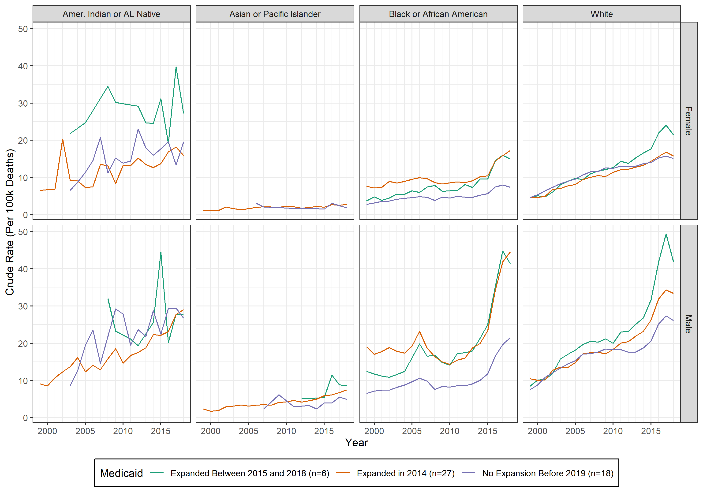

# wondeR: A package to pull, analyze, and visualize data from the CDC Wonder

## Disclaimer
This project is a work-in-progress. It works in some cases but may not work in many others (and may not be flexible enough for some users), and some extra code exists for functions that are not yet operational. This program has only been tested in Windows 10.


## Installation

Before you can use the `get_data` function, you need to:

1. Ensure that you have Python3 installed. You will need to locate your python.exe file. In Windows, you can run the following to figure out where that is:

```console
where python
```

2. Install the [wonderpy package for Python3](https://www.github.com/tlcaputi/wonderpy)

```console
pip install https://github.com/tlcaputi/wonderpy.git#egg=wonderpy
```

3. Install PythonInR in R

```{r}
install.packages('PythonInR')
library(PythonInR)
```

4. Install this package

```{r}
library(devtools)
devtools::install_github('tlcaputi/wondeR')
```

## Usage

The first step is to collect data. This implements the [wonderpy package for Python3](https://www.github.com/tlcaputi/wonderpy) within R. For demonstration, we pull the data for [all drug overdoses](https://cdn.ymaws.com/www.cste.org/resource/resmgr/Injury/Analysis_of_data_on_drug_poi.pdf), which is all deaths that include at least one ICD10 code in T36-T50 AND at least one ICD 10 code in X40-X44, X60-X64, X85, or Y10-Y14.


```{r}
library(wondeR)


df <- get_data(
  ROOTPATH = "/path/to/root", # this should include an "input" and "output" subdirectory
  RUNNAME = "sex_race_overdose", # Name of the run
  replace = T, # Default True, if False then this will not collect data
  pypath = "/path/to/python.exe", # Path to your python3.exe file (see above)

  ## Collect data on deaths that include these ICD10 codes
  MCD1 = c("T36-T50"), ## Any of these codes...
  MCD2 = c("X40-X44", "X60-X64", "X85", "Y10-Y14"), ## AND any of these codes. Defaults to c(NA), which is All death codes

  ## Segment the data based upon these variables
  by_vars = c("state", "sex", "race") # can be sex, age, race, hispanic, state
)

```

Note that you can use code ranges in the `MCD1` or `MCD2` arguments.

If you want to collect the data yourself or using the wonderpy package within Python, you can make the `replace` argument `False` and ensure the data file matches the format of RUNNAME + "_pull.csv" in your input subdirectory. In this case, you'd want to make sure that "ROOTPATH/input//opioids_pull.csv" exists. You should still run the data through `get_data` before moving onto future functions.


Combine this data with the `plot_grid` function to create line plots.


```{r}

out <- plot_grid(
  df, # Data frame from get_data

  ## Should be same as above
  ROOTPATH = "C:/Users/tcapu/Google Drive/modules/wondeR/READMEcode",
  RUNNAME = "sex_race_overdose",

  ## Convenience arguments
  minwonderyear = 1999, # Min year that WONDER collects
  maxwonderyear = 2018, # Max year that WONDER collects

  ## Multiple Lines within the Same Plot
  # Create the names for the groups that you want
  groups = c(
    "No Expansion Before 2019",
    "Expanded in 2014",
    "Expanded Between 2015 and 2018"
  ),

  # Write the conditions for those groups as strings
  group_conditions = c(
    "is.na(aca_date) | year(aca_date) > 2018",
    "year(aca_date) == 2014",
    "T"
  ),

  # Legend Title for the Groups
  group_title = "Medicaid",

  # Will add n= values to the group labels
  include_n = T,

  # If True, will only include data from state-years with data for all groups
  listwise = F,


  ## Multiple plots in a grid
  # Segment data by x and y
  grid_vars = c("sex", "race"),

  ## Plot Arguments
  xlab = "Year",
  ylab = "Crude Rate\n(Per 100k Deaths)",
  colpalette = "Dark2", # ggplot theme
  vline = T, # If logical, no vertical line. If numeric/date, a dotted vertical line

  ## Plot Saving arguments
  save = T, # If True, a plot will be saved
  out_fn = T, # If logical, will be named after RUNNAME
  width = 6, # width in inches
  height = 4, # height in inches

  ## Do you want to return the data or just the plot?
  include_data = T
)
```


If you set `include_data = T`, the resulting plot (a ggplot) will be the first item in the resulting list.


```{r}
p <- out[[1]]
ggsave("./output/Fig1.png", p, width = 10, height = 7)

```



